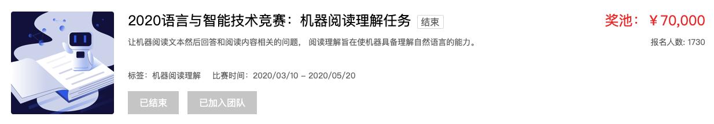
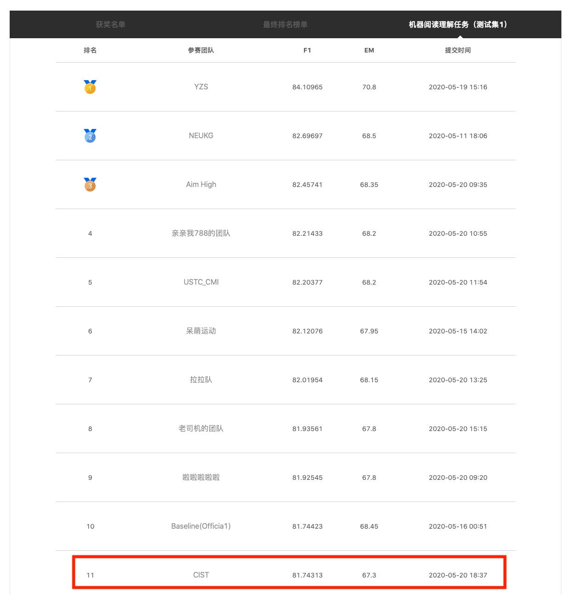
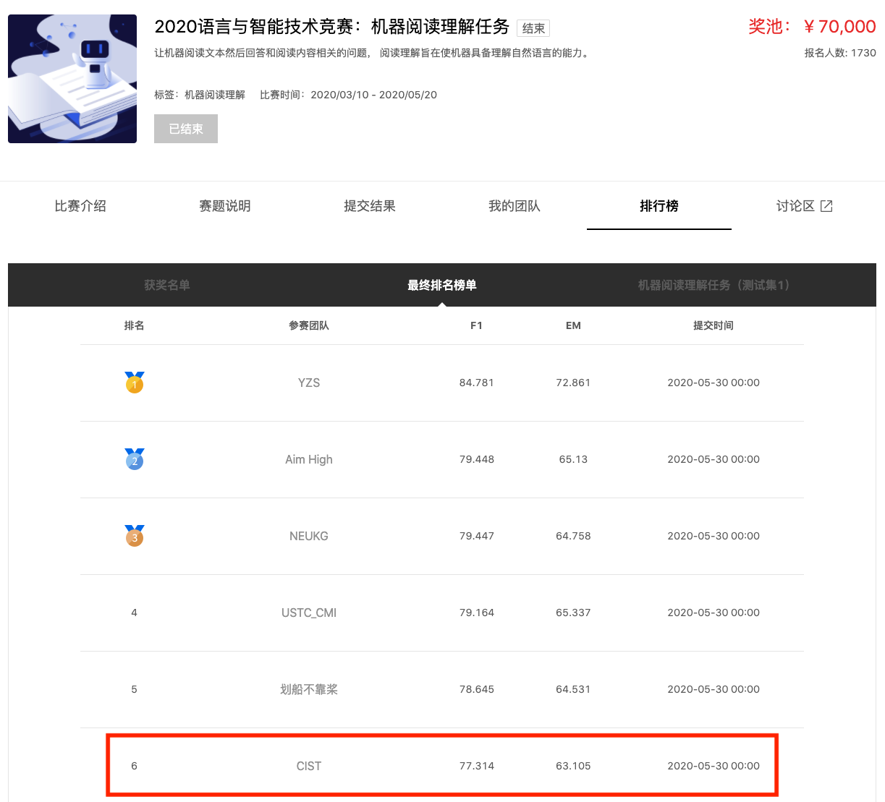

# LIC2020

[2020语言与智能技术竞赛：机器阅读理解任务](https://aistudio.baidu.com/aistudio/competition/detail/28?isFromCcf=true)

# 数据说明

## 竞赛内部数据

本次评测的阅读理解数据集 (即DuReader robust) 旨在衡量阅读理解模型的鲁棒性，评测模型的过敏感性、过稳定性以及泛化能力。该数据集包括训练集、开发集以及测试集： 
* 训练集（领域内，in-domain）: 该训练集是利用大规模中文阅读理解数据集DuReader 2.0中的实体类问题构建而成的，共包含15K个样本；数据集中的问题均为百度搜索中的真实用户问题，数据集中的文档均来自百度搜索结果中的普通网页或百度知道中的问答页面。
* 开发集（领域内，in-domain）：开发集的构造方法和来源与训练集相同，共包含1.4K个样本。
* 测试集：本次评测所使用的测试集包含四个部分，一个领域内（in-domain）测试集和三个鲁棒性测试集，具体如下：
    * 领域内（in-domain）测试集: 该部分的构造方法和来源与训练集、开发集相同，共包含1.3K个样本。
    * 过敏感（over-sensitivity）测试集：该部分首先对领域内测试集中的样本进行随机采样，然后对样本中的问题生成复述，构成新的样本。新的样本用于测试模型在相同的篇章上，对于语义相同、表述不同的复述问题，是否能正确的、稳定的产生相同的回答。如果模型对这些复述问题生成了不同的、错误的答案，则我们称模型存在过敏感的问题。与之前的相关工作不同[1]，该部分生成的复述问题，都是搜索引擎中用户问过的真实问题。该部分共包含1.3K个样本。
    * 过稳定（over-stability）测试集：该部分首先对领域内数据集中的样本通过规则进行采样，被选取样本的篇章中包含多个和参考答案类型相同的实体（称为干扰答案）。然后由专业人员根据篇章、参考答案以及干扰答案标注新的问题，构成新的样本。其中，新标注的问题与干扰答案所在句（称为干扰句）之间有许多相同的词汇。如果模型不能够区分答案句和干扰句，即模型过于稳定地仅通过字面进行匹配，而未进行语义匹配，则我们称模型存在过稳定的问题。与之前的相关工作不同[2]，该部分的篇章都是真实篇章，而非通过构造、拼接干扰句构造而成。该部分共包含0.8K个样本。
    * 泛化能力（generalization）测试集：该部分样本的领域分布与训练集的领域分布不同，主要由教育领域（数学、物理、化学、语文等）以及金融领域的真实文本构建而成。该部分用于测试模型在未知领域（out-of-domain）上的泛化能力。如果模型在该部分的效果下降较多，则我们称模型的泛化能力不够好。该部分共包含1.6K个样本
## 外部数据
### LETC
“莱斯杯”全国首届“军事智能·机器阅读”挑战赛。面向于军事领域，共包含约7万个军事类复杂问题，每个问题对应五篇文章。训练数据集：包含约5万个问题-答案对；初赛测试数据集：包含约0.5万个问题；复赛测试数据集：包含约1万个问题；决赛测试数据集：包含约0.5万个问题。
### CAIL2019
2019中国“法研杯”司法人工智能挑战赛（CAIL2019）。聚焦在法律要素抽取、法律阅读理解、相似案例匹配三个真实场景的任务。我们提取了其中的阅读理解数据，约3.3万条。
### CMRC2018
第二届“讯飞杯”中文机器阅读理解评测(CMRC 2018)。该数据集由人类专家在Wikipedia段落上注释的近20,000个真实问题组成。
### DRCD
台湾阅读理解资料集Delta Reading Comprehension Dataset (DRCD)是繁体中文阅读理解资料集。包含约3万多个问题。我们在对数据进行简体化处理后作为外部数据引入。
### DuReader
百度大规模的中文机器阅读理解数据集。DuReader中所有的问题、原文都来源于实际数据，答案是由人类回答的。每个问题都对应多个答案，数据集包含200k问题、1000k原文和420k答案。DuReader将问题分为：Entity、Deion和YesNo。我们选择了Entity的问题作为外部数据，并对答案做了修改，使其由生成式变为抽取式。
### WebQA
百度2016发布发的问答数据集。
### 百度短答案
百度短答案数据：来自于百度知道、百度百科、百家号三个源的精准问答数据，答案都比较短
### 作业帮
作业帮数据：来自于作业帮，可认为属于教育领域，但是收集到的数据量并不多，对模型最终效果达不到预期增益
### QQ相似度扩展数据集
针对鲁棒性测试集中的过敏感问题：按照过敏感测试集的构建流程，用QQ相似度服务召回了一批train集中query的相似query，卡了0.85的阈值，并进行了人工过滤，过滤了与原问题意思不符的query，以及语法存在错误的query。
### 模板扩展数据集
针对鲁棒性测试集中的过敏感问题：我们手动编写了40余条规则来针对问题中的疑问词进行替换，生成新的问题。

| 数据集             | 数据集原始开源链接                                           | 数据来源                   | 数据量 |
| ------------------ | ------------------------------------------------------------ | -------------------------- | ------ |
| LETC2018           | 不开源                                                       | 莱斯杯2018年竞赛           | 50k    |
| CAIL2019           | https://github.com/china-ai-law-challenge/CAIL2019/tree/master/%E9%98%85%E8%AF%BB%E7%90%86%E8%A7%A3 | 2019“法研杯”               | 33k    |
| CMRC2018           | https://github.com/ymcui/cmrc2018                            | 第二届“讯飞杯”             | 14363  |
| DRCD               | https://github.com/DRCKnowledgeTeam/DRCD                     | 台湾阅读理解资料集         | 26936  |
| DuReader           | http://ai.baidu.com/broad/download?dataset=dureader          | 百度知道，百度搜索         | 200k   |
| WebQA              | http://idl.baidu.com/WebQA.html                              | 百度知道等                 | 42k    |
| 百度短答案         | 不开源                                                       | 百度知道，百度百科，百家号 | 48526  |
| 作业帮             | 不开源                                                       | 作业帮                     | 8908   |
| QQ相似度扩展数据集 |                                                              | QQ相似度扩展               | 12236  |
| 模板扩展数据集     |                                                              | 模板扩展                   | 26270  |

**数据集：** data_join文件夹里包含了所有用到的数据集

# 模型
基于pytorch版本的[transformers](https://github.com/huggingface/transformers)开发
## 版本
### ChineseMRC（[ChineseMRC](https://github.com/LIC2020/ChineseMRC) ）
这个模型是根据transformers中的run_squad.py改进而来。
### ChineseMRCV2
增加了文档中每个token的绝对位置，作为embedding
### ChineseMRCV3
增加了关键词标示作为输入

## 训练方法
1. WWM预训练
2. 超参数设置
3. 训练顺序
## QA特征
1. 空格问题
2. 数字修饰词问题
3. 列表类答案不全问题
## 模型集成方法（[MRCEnsemble](https://github.com/LIC2020/MRCEnsemble) ）
* 平权答案投票法
    * 投票：假设多个模型共产生了n个候选答案，对于其中的某一个候选，有几个模型预测了这个候选，就记为几票。
* 加权答案投票法
    * 累加prob：
    * 累加prob取平均:
    * 累加sigmoid(logit):
    * 按照顺序打分（递减）：
    * 按照顺序打分（衰减）：
* 平权概率投票法
* boosting方法

# Leaderboard

test1阶段

test2阶段

# Contributing

[bestbzw](https://github.com/orgs/LIC2020/people/bestbzw), [liuaiting](https://github.com/orgs/LIC2020/people/liuaiting), [Pikachu](https://github.com/orgs/LIC2020/people/Junpliu), [WK-Chen](https://github.com/orgs/LIC2020/people/WK-Chen)

